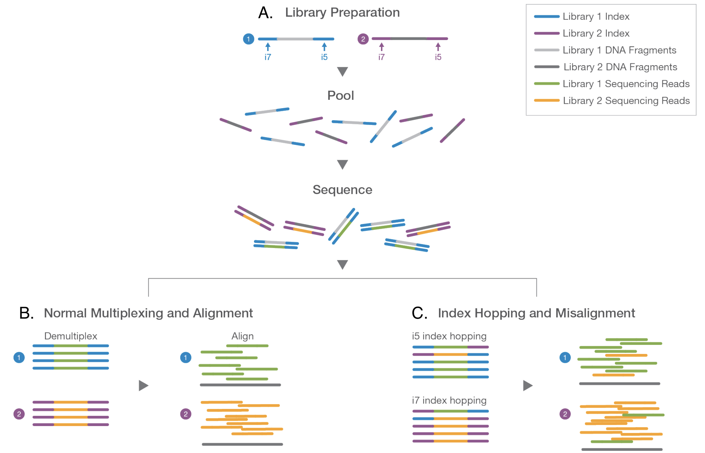

# Evaluation of index hopping using unique dual-indexes in an RNA-seq experiment

Contributors: 2017 BGMP Cohort

## Motivation

Sequencing of DNA and RNA using next-generation sequencing (NGS) technology has allowed for rapid advances in the biological sciences, and is driving parallel advancements in computational tools for processing genomic data. When Illumina centered itself in the market by acquiring Solexa and its Genome Analyzer, it became apparent that the race for the fastest and highest-throughput sequencing technology was on.[^1]

Often with increased speed comes decreased sensitivity. Largely, Illumina’s NGS technology has been able to maintain high sensitivity by performing 'bridge amplification' of DNA fragments prior to sequencing, producing clusters of millions of DNA molecules. Molecules in these clusters can be sequenced with a base call accuracy greater than 95%.

|  |
|--| 
| **Figure 1: Overview of Multiplexing and Index Hopping** – Schematic showing the effect of hopped indexes on alignment of reads.    **A.** Typical multiplexed Illumina library preparation method using indexes to identify and pool different samples. **B.** During computational demultiplexing of data, reads are sorted into their proper sample "bins" using the associated index. **C.** Index hopping can cause samples to be mis-assigned and interfere with downstream analysis.    Image adapted from [^3]. |

High-throughput sequencing on Illumina instruments has allowed for sequencing of many samples in one flow cell lane through a process called 'multiplexing' (Fig 1A). The multiplexing of samples decreases the cost per run and can allow for the combination of well-controlled, distinct sequencing experiments in the same sequencing run. Samples are differentiated by unique molecular indexes that allow for 'demultiplexing' of the generated reads by sample (Fig 1B).

Illumina’s newest models of sequencers are implementing a new clustering chemistry, referred to as Exclusion Amplification (ExAmp), to optimize cluster generation on the patterned flow cells of the Hiseq 4000, HiSeq X series, and NovaSeq. Recently, researchers have reported that this chemistry can lead to a 'spread of signal' in the demultiplexed reads. This discovery has lead to concern in the scientific community. [^2]

Sequencing instruments utilizing patterned flow cells clustered with ExAmp chemistry do not wash away index primers after they are introduced. This leads to excess index primers. These excess primers can prime pooled library fragments at random via complementary 3′ ends. These complementary ends get extended by DNA polymerase, creating a new library molecule with an incorrect index before binding to the patterned flow cell to generate a cluster for sequencing. [^3] The result is a read that looks like it came from library A, but in reality came from library B. This is called index hopping, and has the potential to confound experiments if not properly addressed (Fig 1C).

Here, an mRNA-seq experiment was carried out using unique dual indexes to assess the degree of index hopping that occurred as a result of both library preparation and sequencing on an Illumina HiSeq 4000.

## Library preparation

RNA was isolated by a collaborating lab from mouse embryonic fibroblasts treated with FOX & MBNL (alternative splicing factors; N = 3), just FOX or MBNL (N = 3 each), and no treatment (N = 3). Each sample was processed with 2 technical replicates for a total of 24 samples. Each were checked initially for quality by Fragment Analyzer and qPCR.

The 24 samples were paired randomly such that no pair had the same biological or technical replicate. Quantity of input mRNA was assessed using the Qubit RNA assay. Each pair of samples processed through library preparation by a different individual to decrease batch effect. Libraries were prepared using KAPA’s Stranded mRNA-Seq kit, following an in-house laboratory protocol adapted by the Genomics and Cell Characterization Core Facility at the University of Oregon. We selected for 300-400 bp cDNA fragments. Dual-indexed adapters were used for each library (Table 1).

### Table 1: Library treatments and indices

Library | Group | Treatment | Index | Index sequence
:---:|:---:|---|:---:|---
1 | 2A | control | B1 | GTAGCGTA
2 | 2B | control | A5 | CGATCGAT
3 | 2B | control | C1 | GATCAAGG
4 | 2C | MBNL | B9 | AACAGCGA
6 | 2D | MBNL | C9 | TAGCCATG
7 | 2E | FOX | C3 | CGGTAATC
8 | 2F | FOX | B3 | CTCTGGAT
10 | 2G | both | C4 | TACCGGAT
11 | 2H | both | A11 | CTAGCTCA
14 | 3B | control | C7 | CACTTCAC
15 | 3C | MBNL | B2 | GCTACTCT
16 | 3D | MBNL | A1 | ACGATCAG
17 | 3E | FOX | B7 | TATGGCAC
19 | 3F | FOX | A3 | TGTTCCGT
21 | 3G | both | B4 | GTCCTAAG
22 | 3H | both | A12 | TCGACAAG
23 | 4A | control | C10 | TCTTCGAC
24 | 4A | control | A2 | ATCATGCG
27 | 4C | MBNL | C2 | ATCGTGGT
28 | 4D | MBNL | A10 | TCGAGAGT
29 | 4E | FOX | B8 | TCGGATTC
31 | 4F | FOX | A7 | GATCTTGC
32 | 4G | both | B10 | AGAGTCCA
34 | 4H | both | A8 | AGGATAGC

All libraries were quality assessed on the Advanced Analytical Fragment Analyzer, and final library quantitation was performed via qPCR with 3 replicates per library. Final library concentrations were then size-adjusted and all libraries were normalized into one pool. This single pool was sequenced on one lane of a 2 x 101 run on an Illumina HiSeq 4000. Libraries 11, 17, 19, 28, 29 (Table 1) were included for sequencing because they contained significant adapter and adapter dimer peaks, as suggested by the [Fragment Analyzer trace](2017_frag_analy.pdf).

[^1]: Rae, CK. The year of sequencing: in 2007, the next-generation sequencing technologies have come into their own with an impressive array of successful applications. *Nature Methods* 5, 11-14 (2008).

[^2]: Sinha R, Stanley G, Gulati GS, Ezran C, Travaglini K, *et al*. Index switching causes “spread-of-signal” among multiplexed samples in Illumina HiSeq 4000 DNA sequencing. bioRxiv doi: http://dx.doi.org/10.1101/125724 (2017).

[^3]: Effects of Index Misassignment on Multiplexing and Downstream Analysis. Illumina. 2017. Accessed October 2017.
